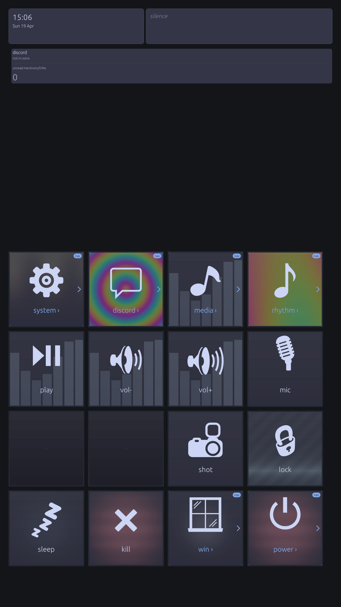
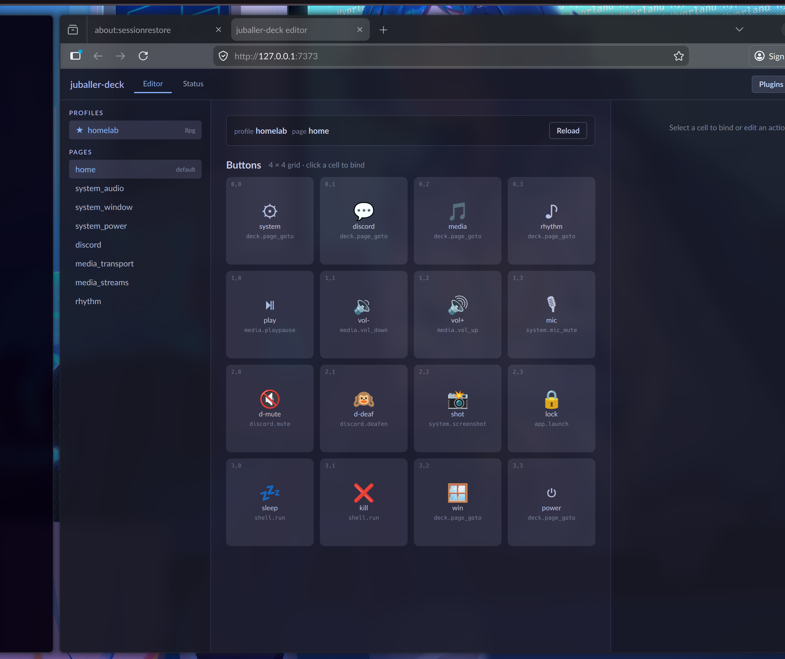
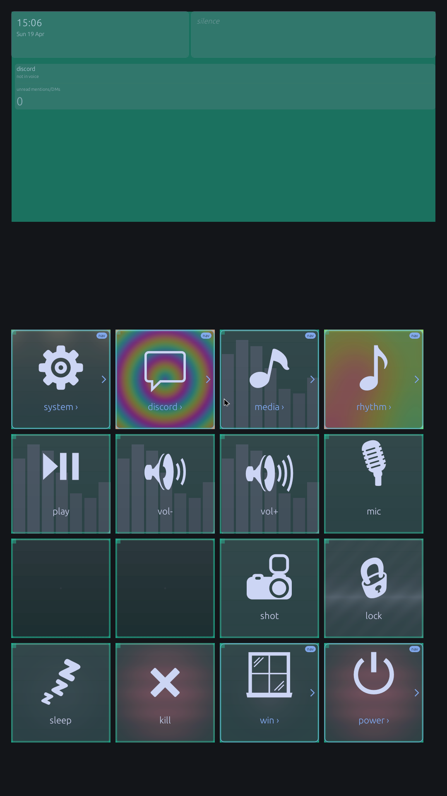
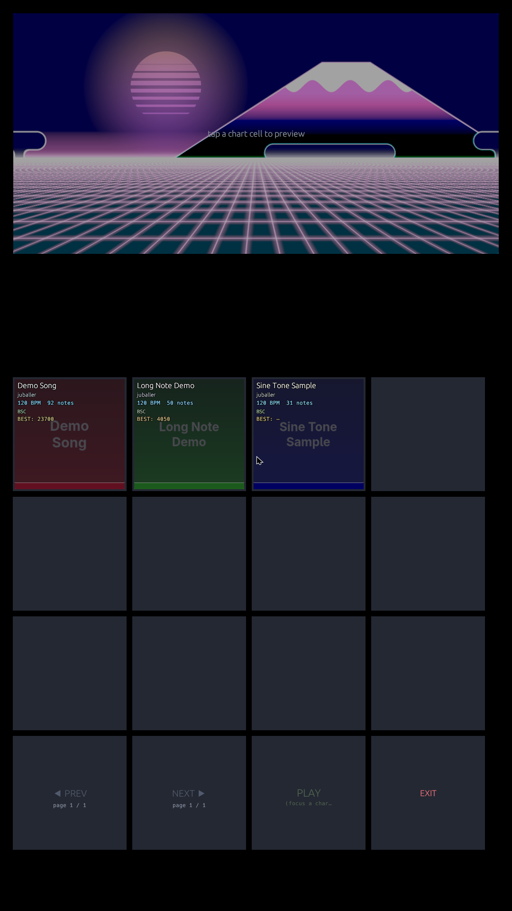

<a id="readme-top"></a>

[![Contributors][contributors-shield]][contributors-url]
[![Forks][forks-shield]][forks-url]
[![Stargazers][stars-shield]][stars-url]
[![Issues][issues-shield]][issues-url]
[![MIT License][license-shield]][license-url]
[](https://github.com/jacob-sabella/juballer/actions/workflows/ci.yml)

# juballer

A Rust utility platform for the [GAMO2 FB9](https://www.gamo2.com/) — a USB
4×4 grid controller. Treats the device as a programmable display + input
surface: each of the 16 cells is its own GPU-rendered tile, the row above
the grid is a free-form HUD, and physical key presses are forwarded to
whatever widget owns that cell.

Built on [wgpu](https://wgpu.rs) and [egui](https://github.com/emilk/egui)
so every cell can host a shader, an image, an animated widget, or a custom
UI panel — without giving up a sub-frame input path. Cross-platform:
**Linux** (primary) and **Windows**, with macOS support via the same wgpu
backend.










## Features

### Deck runtime

- **16 GPU tiles + 1 free-form top region.** Every cell gets its own
  viewport, scissor, and pipeline state. Top region runs an egui overlay
  for any HUD layout.
- **Per-cell shaders.** Drop a WGSL fragment shader into the deck and
  any cell can render it. Animated backgrounds, audio-reactive scopes,
  status indicators — all via the same uniform block.
- **Geometry calibration.** `juballer-deck calibrate` walks the cell grid
  through a fullscreen overlay, lets you nudge edge padding and per-axis
  gaps, and writes the result into the active profile.
- **Per-profile keymaps.** A `[keymap]` section in `profile.toml` maps
  `(row, col)` → `KEY_*` so the same composition works across keyboards
  or controllers.
- **Live config watcher.** Edit `deck.toml`, save, and the running deck
  rebuilds widgets without restarting. Backed by a debounced
  [`notify`](https://crates.io/crates/notify) watcher with ignore
  prefixes for log churn.
- **Built-in widgets.** Clock, now-playing, image tile, shader tile —
  anything more involved drops into the plugin host.

### Plugin host

- **Out-of-process plugins.** Plugins are separate binaries that talk to
  the deck over a length-prefixed JSON protocol on a Unix socket. A crash
  in a plugin doesn't take down the deck; the host just stops painting
  that tile.
- **Typed protocol.** `crates/juballer-deck-protocol/` defines the wire
  schema (cell rects, paint commands, input events, lifecycle messages).
  Build a plugin in any language that can speak length-prefixed JSON.
- **Built-in actions.** The action registry exposes `play`, `calibrate`,
  `settings`, `mods`, `rhythm-launch`, etc. so a plugin can map a tile
  press to "switch to rhythm mode on this chart".

### Live editor

- **HTTP + WebSocket editor.** `juballer-deck editor` brings up an axum
  server with a REST surface for pages / widgets and a WebSocket bus for
  live updates. Profile reloads, page writes, and preview activations
  all flow through the same event stream.
- **Atomic page writes.** Page edits write to a temp file and rename;
  no half-written `deck.toml` if the editor crashes mid-save.

### Rhythm-game mode

The grid happens to be the right shape for a tap rhythm game, so the
deck ships one. It's an optional surface on top of the deck runtime, not
a required dependency — nothing else in the workspace depends on it.

- Loads charts in [memon v1.0.0](https://memon-spec.readthedocs.io/) — an
  open-source JSON chart format. Tap notes, long (held) notes, mid-song
  BPM changes, fractional `t` times, per-chart timing overrides.
- Real-time judging with configurable hit windows, per-grade SFX, life
  bar, and post-session offset suggestion.
- Chart picker scans a directory of `*.memon` files into a paginated
  grid with audio preview, jacket art, banner art, favorites, and
  per-chart audio-offset overrides.
- Audio-offset calibration utility (`calibrate-audio`).
- Tutorial mode for first-run users.
- In-app rhythm settings + mods editors that write back to `deck.toml`.

The rhythm pipeline lives entirely under
`crates/juballer-deck/src/rhythm/`.

## Install

### From source

Requires Rust 1.80+ (pinned in `rust-toolchain.toml`).

```bash
cargo build --release -p juballer-deck
cp target/release/juballer-deck ~/.local/bin/
```

A release tarball script is bundled for distribution:

```bash
scripts/release.sh
# Produces dist/juballer-<version>-linux-x86_64.tar.gz
```

## Usage

### Bring up the deck

```bash
juballer-deck check                 # validate config and exit
juballer-deck                       # run with the default profile
juballer-deck --profile work        # switch profiles per session
```

The deck reads its config from `~/.config/juballer/deck/` by default.
Override with `--config <DIR>`.

### Calibrate the grid

```bash
juballer-deck calibrate
```

Fullscreen overlay. Adjust geometry + keymap, press Enter to persist,
Escape to cancel.

### Run the rhythm mode against the bundled samples

```bash
juballer-deck play assets/sample/                       # chart picker
juballer-deck play assets/sample/long_demo.memon        # specific chart
juballer-deck play assets/sample/ --difficulty ADV      # pick difficulty
```

`play` with no path falls back to `rhythm.charts_dir` from `deck.toml`.

### Launch the editor

```bash
juballer-deck editor --bind 127.0.0.1:8765
```

Open `http://127.0.0.1:8765/` to live-edit pages and widgets.

## Build from Source

```bash
# Development build
cargo build

# Repository-wide style + lint + test gate (mirrors CI)
scripts/check.sh

# Run a specific crate's tests
cargo test -p juballer-deck

# Format the workspace
cargo fmt --all
```

The style guide lives at [`docs/STYLE.md`](docs/STYLE.md). Formatting is
enforced by `rustfmt.toml`; lints by the `[workspace.lints]` block in the
root `Cargo.toml`.

## Architecture

```
                  juballer-core (wgpu + winit)
              ┌──────────────────────────────────┐
              │ Frame: 16 cell viewports +       │
              │        1 top-region rect         │
              │ Input: evdev → (row, col, key)   │
              └────────────┬─────────────────────┘
                           │
   ┌───────────────────────┼─────────────────────────┐
   │                       │                         │
   v                       v                         v
┌──────────┐         ┌──────────┐              ┌──────────┐
│  Deck    │         │  Editor  │              │  Plugin  │
│  runtime │<──────→ │  HTTP/WS │              │   host   │
│  (deck)  │  bus    │  server  │              │  (uds)   │
└────┬─────┘         └──────────┘              └──────────┘
     │
     v
┌──────────────────────────────────────────────────────┐
│ Widgets: clock | now-playing | shader | image | …    │
│ Modes:   rhythm | settings | calibrate | tutorial    │
└──────────────────────────────────────────────────────┘
```

- **`juballer-core`** — wgpu render loop, geometry calibration, raw input
  (Linux evdev / Windows raw input), profile loader, frame primitives.
- **`juballer-egui`** — shared egui overlay scaffolding used by HUDs,
  the chart picker, and the editor preview.
- **`juballer-deck`** — deck runtime, widget registry, plugin host,
  editor server, action registry, and the rhythm-mode pipeline.
- **`juballer-deck-protocol`** — typed message schema for the plugin
  socket.
- **`juballer-gestures`** — corner-hold / multi-press gesture recognizer
  used for in-app emergency exits and modifier shortcuts.

## Dependencies

| Crate                         | Purpose                                                        |
|-------------------------------|----------------------------------------------------------------|
| `wgpu`                        | GPU backend (Vulkan on Linux, DX12 on Windows, Metal on macOS) |
| `winit`                       | Window + event loop                                            |
| `egui`                        | Immediate-mode UI for HUDs, picker, settings, editor preview   |
| `evdev`                       | Raw Linux input from the controller's keyboard interface       |
| `notify`                      | Live config + chart-directory watching                         |
| `tokio` + `axum`              | Editor HTTP/WS server                                          |
| `clap`                        | CLI parsing                                                    |
| `image`                       | Jacket / banner / sprite decoding                              |
| `tracing`                     | Structured logging                                             |
| `serde`, `serde_json`, `toml` | Config + chart parsing                                         |

## Background shader credits

The bundled background shaders under
`crates/juballer-deck/examples/shaders/backgrounds/` are ports of
publicly available [Shadertoy](https://www.shadertoy.com/) entries.
Per Shadertoy's default terms, the originals are licensed
**CC BY-NC-SA 3.0** (attribution required, non-commercial use, share-alike).
juballer is a personal / non-commercial project. If you ship juballer
commercially you must replace these backgrounds with original work or
obtain separate licenses from the authors.

| File                     | Source                                            | Author / Inspiration                                                                              |
|--------------------------|---------------------------------------------------|---------------------------------------------------------------------------------------------------|
| `bg_oscilloscope.wgsl`   | <https://www.shadertoy.com/view/slc3DX>           | Oscilloscope music (2021), incription                                                             |
| `bg_fractal.wgsl`        | <https://www.shadertoy.com/view/llB3W1>           | Fractal Audio 01                                                                                  |
| `bg_cyber_fuji.wgsl`     | <https://www.shadertoy.com/view/fd2GRw>           | Cyber Fuji 2020 (audio reactive)                                                                  |
| `bg_dancing_cubes.wgsl`  | <https://www.shadertoy.com/view/MsdBR8>           | Dancing cubes — based on Shane's *Raymarched Reflections* (<https://www.shadertoy.com/view/4dt3zn>) |
| `bg_galaxy.wgsl`         | <https://www.shadertoy.com/view/NdG3zw>           | "CBS" — Audio Reactive Galaxy (inspired by JoshP's *Simplicity*, <https://www.shadertoy.com/view/lslGWr>) |
| `bg_inversion.wgsl`      | <https://www.shadertoy.com/view/4dsGD7>           | The Inversion Machine, Kali                                                                       |

The full credit / license text is in
[`crates/juballer-deck/examples/shaders/backgrounds/LICENSES.md`](crates/juballer-deck/examples/shaders/backgrounds/LICENSES.md).

If you are an author of one of these shaders and would like your work
removed from this project, please email **jacobsabella@outlook.com** —
the shader file will be deleted on request, no questions asked.

## Vibe Coded

This entire project was vibe coded with [Claude Code](https://claude.ai/code).
Architecture, deck runtime, plugin host, editor server, rhythm pipeline,
chart parser, shader scaffolding, calibration tooling — all of it. No
hand-written code.

## License

Distributed under the MIT License. See [LICENSE](LICENSE).

[contributors-shield]: https://img.shields.io/github/contributors/jacob-sabella/juballer.svg?style=for-the-badge
[contributors-url]: https://github.com/jacob-sabella/juballer/graphs/contributors
[forks-shield]: https://img.shields.io/github/forks/jacob-sabella/juballer.svg?style=for-the-badge
[forks-url]: https://github.com/jacob-sabella/juballer/network/members
[stars-shield]: https://img.shields.io/github/stars/jacob-sabella/juballer.svg?style=for-the-badge
[stars-url]: https://github.com/jacob-sabella/juballer/stargazers
[issues-shield]: https://img.shields.io/github/issues/jacob-sabella/juballer.svg?style=for-the-badge
[issues-url]: https://github.com/jacob-sabella/juballer/issues
[license-shield]: https://img.shields.io/github/license/jacob-sabella/juballer.svg?style=for-the-badge
[license-url]: https://github.com/jacob-sabella/juballer/blob/main/LICENSE
